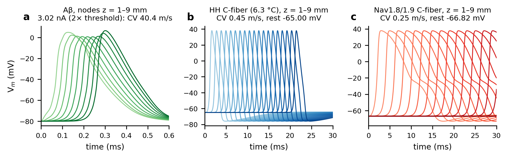

New Cairo STEM School, Cairo, Egypt  
Corresponding author: Mina.3024031@stemnewcairo.moe.edu.eg  
ORCID: [author to insert ORCID iD before submission]

**Abstract.** Ephaptic excitation of unmyelinated C-fiber nociceptors by myelinated Aβ afferents at sites of nerve injury has been proposed as a mechanism of tactile allodynia. We tested whether it can reach threshold in a closed-loop core-conductor model. A CRRSS Aβ axon and a C-fiber with Hodgkin–Huxley or phenomenological Nav1.8/Nav1.9 kinetics share a restricted extracellular compartment along a 5-mm lesion. Intracellular and extracellular potentials are solved together, and every endpoint is shown to converge. A single Aβ action potential depolarized the C-fiber by 1.56 mV. Synchronous volleys, equivalent to smaller extracellular cross-sections per fiber, raised this to at most 26.9 mV; the response was limited not by saturation but by failure of Aβ conduction inside the confined lesion. The depolarization lasted ~70 µs, was spatially narrow and was flanked by hyperpolarization, so no fixed voltage threshold applied: a 0.1-ms pulse could drive the Nav1.8/Nav1.9 membrane to 39 mV without firing it, and the recorded ephaptic drive had to be amplified 4.6-fold to fire it at 25 synchronous fibers. No C-fiber action potential occurred over five decades of extracellular leak, lesions of 1–7 mm, stimuli of 1.2–20× threshold, 50–400-Hz trains or sensitizing bias currents, and a 0.5-ms onset dispersion removed 85 % of the drive. Faster gating alone had no effect; action potentials appeared only when the whole Hodgkin–Huxley membrane was made faster (time constant ≤ 0.37 ms), never with Nav1.8/Nav1.9 kinetics, whose activation lies 42 mV above rest. Direct ephaptic Aβ→C excitation therefore requires conditions that also block the Aβ source.

**Keywords:** ephaptic coupling · core-conductor model · C-fiber nociceptor · Nav1.8 · mechanical allodynia · numerical convergence

## 1 Introduction

Dynamic mechanical allodynia, pain evoked by light moving touch, is a hallmark of many peripheral neuropathic conditions. One peripheral mechanism proposed for it is ephaptic coupling: at sites of demyelination or compression, current generated by large myelinated Aβ afferents might flow through a shared, restricted extracellular space and excite neighbouring unmyelinated C-fiber nociceptors directly. Ephaptic transmission between single fibers has been demonstrated in injured or dysmyelinated preparations: in chronically damaged peripheral nerves (Seltzer & Devor, 1979), in the amyelinated spinal roots of dystrophic mice (Rasminsky, 1980) and among the densely packed unmyelinated axons of the olfactory nerve (Bokil et al., 2001). Even between intact myelinated afferents in rat dorsal roots, passing impulses transiently raise the excitability of neighbouring fibers (Bolzoni & Jankowska, 2019). Rapid ephaptic interactions were first characterized between adjacent fibers by Katz and Schmitt (1940) and Arvanitaki (1942). By contrast, the cross-excitation between A- and C-neurons observed in dorsal root ganglia (Devor & Wall, 1990; Amir & Devor, 2000) is slow and has been attributed largely to non-synaptic chemical mediation rather than to ephaptic current flow (Amir & Devor, 1996). It is therefore not direct evidence for ephaptic Aβ→C excitation in nerve trunks. Whether ephaptic Aβ→C coupling can reach the C-fiber's firing threshold is a quantitative question that is hard to settle experimentally, which motivates modelling.

Computational studies of ephaptic coupling either impose the field of an active fiber on a passive or excitable target without feedback, as in the cable treatment of endogenous fields by Goldwyn and Rinzel (2016), or solve the coupled intracellular–extracellular problem for bundles of similar fibers. The latter include closed-loop core-conductor models of myelinated or demyelinated bundles (Binczak et al., 2001; Reutskiy et al., 2003; Schmidt et al., 2021; Schmidt & Knösche, 2022), sheets of coupled axons (Sheheitli & Jirsa, 2020), higher-dimensional formulations of interacting tracts (Chawla et al., 2021; Chawla & Morgera, 2024), resistor-network models of whole nerve trunks (Capllonch-Juan & Sepulveda, 2020), and fully resolved extracellular–membrane–intracellular (EMI) models (Jæger & Tveito, 2026). The coupling between two physiologically dissimilar fiber classes, a fast saltatory Aβ fiber and a slow, thin C-fiber, has received less attention. That pairing raises its own questions: whether a brief Aβ transient can excite a C-fiber whose membrane is slow, whether synchronous volleys of many Aβ fibers can make up for weak single-pair coupling, and how the answer depends on unmeasured extracellular parameters.

Here we address these questions with a closed-loop core-conductor model of a CRRSS Aβ fiber and a C-fiber that share a restricted extracellular compartment along a focal lesion. The C-fiber has either classical Hodgkin–Huxley kinetics (Phase 1) or a phenomenological Nav1.8/Nav1.9 membrane (Phase 2), within otherwise identical models. Two features of the problem make it easy to get wrong numerically, and we treat both explicitly. A coupling scheme that evaluates the extracellular potential from the previous time step has an error that grows with the number of fibers, so an apparent saturation of multi-fiber summation can be produced by the discretization alone; we therefore solve the coupled system monolithically and verify convergence for every endpoint. And a stimulating electrode placed inside the restricted compartment drives it far outside the physiological range, so we place the Aβ stimulus outside the lesion and report what happens when it is not. We place the Aβ stimulus outside the lesion, characterize the C-fiber's excitability for brief inputs directly rather than through a nominal voltage threshold, and map the outcome over the number of synchronous fibers (equivalently, the extracellular cross-section per fiber), the extracellular leak, the lesion length, stimulus strength, temporal dispersion, repetitive trains, sensitizing bias currents and the speed of C-fiber kinetics.

## 2 Methods

### 2.1 Geometry and governing equations

We model one myelinated Aβ axon type and one unmyelinated C-fiber, both of length *L* = 10 mm, that share a restricted extracellular compartment along a focal lesion (z = 2.5–7.5 mm; Fig. 1a). Outside the lesion the fibers lie in grounded bulk fluid (*u*~e~ = 0). The Aβ action potential (AP) is evoked at node 0 (z = 0), outside the lesion, by a 0.2-ms intracellular current pulse of twice the threshold of the uncoupled fiber, and enters the lesion as a propagating wave. *n* identical Aβ fibers are stimulated synchronously (Section 2.5); a single C-fiber is the test fiber.

For fiber *k* (1 = Aβ, 2 = C) with intracellular potential *u*~k~, extracellular potential *u*~e~ and transmembrane potential *v*~k~ = *u*~k~ − *u*~e~, the core-conductor equations are (Fig. 1b)

$$\pi d_k\left(C_{m,k}\frac{\partial v_k}{\partial t}+I_{\mathrm{ion},k}\right)=g_k\frac{\partial^2 (v_k+u_e)}{\partial z^2}+\pi d_k I_{\mathrm{stim},k},\qquad g_k=\frac{1}{r_{i,k}}=\frac{\pi d_k^2}{4\rho_i},$$

where *d*~k~ is the axoplasmic diameter (7 µm for Aβ, i.e. an outer diameter of 10 µm and a g-ratio of 0.7; 1 µm for the C-fiber), ρ~i~ the axoplasmic resistivity, and *C*~m,k~, *I*~ion,k~, *I*~stim,k~ are per unit membrane area. Inside the lesion, conservation of current in the shared compartment gives

$$\frac{1}{r_e}\frac{\partial^2 u_e}{\partial z^2}-G_e u_e+n\,i_{m,1}+i_{m,2}=0,\qquad i_{m,k}=g_k\frac{\partial^2(v_k+u_e)}{\partial z^2},$$

with *r*~e~ = ρ~e~/*A*~e~ the longitudinal resistance per unit length of a compartment of cross-section *A*~e~, and *G*~e~ a transverse leak conductance per unit length from the compartment to grounded bulk tissue. We parameterize the leak by κ = *r*~e~*G*~e~ (m^−2^), so that λ~e~ = κ^−1/2^ is the passive length constant of the compartment alone. Outside the lesion *u*~e~ = 0. The cable ends are sealed. Any current injected by the stimulating electrode leaves through the membrane of the stimulated compartment, which lies outside the lesion in all production runs.

{width=100%}

### 2.2 Membrane models

**Aβ fiber.** Nodes of Ranvier (length *l*~node~ = 1 µm, spacing 1 mm, ten nodes at z = 0, 1, …, 9 mm) carry CRRSS kinetics (Chiu et al., 1979; Sweeney et al., 1987):

$$\alpha_m=\frac{97+0.363\,Y}{1+e^{(31-Y)/5.3}},\quad \beta_m=\frac{\alpha_m}{e^{(Y-23.8)/4.17}},\quad \beta_h=\frac{15.6}{1+e^{(24-Y)/10}},\quad \alpha_h=\frac{\beta_h}{e^{(Y-5.5)/5}}\ \ (\mathrm{ms^{-1}}),$$

with *Y* = *V* + 80 mV and *I*~Na~ = *ḡ*~Na~ *m*^2^*h*(*V* − *E*~Na~). The rate constants are used as given by Sweeney et al. (1987) for 37 °C, without further temperature scaling. Internodes are passive compact myelin. A computational compartment of width Δz containing a node is homogenized with node fraction *f* = *l*~node~/Δz, so that nodal membrane area, capacitance and conductances are independent of the grid (Table 1). Two values depart from Sweeney et al. (1987) and are modelling choices: the nodal capacitance (2.0 rather than 2.5 µF cm^−2^) and the g-ratio (0.7 rather than 0.6).

**C-fiber, Phase 1 (HH).** Classical Hodgkin–Huxley kinetics (Hodgkin & Huxley, 1952) with *ḡ*~Na~ = 120, *ḡ*~K~ = 36, *g*~L~ = 0.3 mS cm^−2^, *E*~Na~ = +50, *E*~K~ = −77, *E*~L~ = −54.4 mV (resting potential −65.00 mV). The rate functions are the squid-axon rates at 6.3 °C, multiplied by φ = 3^(*T*−6.3)/10^ when a temperature *T* is specified (Section 2.6).

**C-fiber, Phase 2 (NavC).** A phenomenological, calibrated TTX-resistant membrane: Nav1.8 (*m*~8~^3^*h*~8~), persistent Nav1.9 (*m*~9~), the HH delayed rectifier (*n*^4^) and a leak,

$$I_{\mathrm{ion},2}=\bar g_{18}m_8^3h_8(V-E_{\mathrm{Na}})+\bar g_{19}m_9(V-E_{\mathrm{Na}})+\bar g_{\mathrm K}n^4(V-E_{\mathrm K})+g_L(V-E_L),$$

with Boltzmann steady states (*V*~1/2~, *k*) = (−25, 6), (−42, 6) and (−50, 5) mV for *m*~8~, *h*~8~ (inactivating) and *m*~9~, and voltage-independent time constants τ~m8~ = 1.5 ms, τ~h8~ = 2 ms and τ~m9~ = 10 ms. The activation parameters are in the range reported for TTX-resistant currents of small DRG neurons (Akopian et al., 1996; Cummins et al., 1999), but the model is a simplification: the time constants are voltage independent, there is no Nav1.7 and only one K^+^ current, and two parameters were calibrated rather than taken from data. With the literature-range inactivation values (*V*~1/2~ ≈ −30 mV, τ~h8~ ≈ 17 ms) the reduced membrane settled on a non-repolarizing depolarized state, so *V*~1/2~ was moved to −42 mV and τ~h8~ to 2 ms; *ḡ*~K~ was raised to 60 mS cm^−2^, and *ḡ*~18~ = 2000 and *ḡ*~19~ = 0.2 mS cm^−2^ were chosen to give an overshooting AP with APD~50~ ≈ 7 ms. Resting potential −66.82 mV.

**Shared cable properties.** Both C-fiber models use the same cable (diameter 1 µm, *C*~m~ = 1 µF cm^−2^, ρ~i~ = 54.7 Ω cm), and ρ~i~ is the same for the Aβ fiber. Phase 1 and Phase 2 therefore differ only in C-fiber membrane kinetics; the Aβ model, stimulus, geometry, numerics and endpoints are identical. All parameters are collected in Table 1 and are read from a single parameter module in the code.

| Group | Quantity | Value | Units | Source / status |
|:---|---:|---:|---:|---:|
| Aβ fiber | outer diameter D₁; g-ratio; axon diameter d₁ | 10; 0.7; 7 | µm; –; µm | g-ratio: modelling choice (Sweeney 1987: 0.6) |
| Aβ fiber | node spacing; node length | 1; 1 | mm; µm | modelling choice |
| Aβ fiber | C_m node; C_m myelin | 2; 0.005 | µF cm⁻² | node: modelling choice (Sweeney 1987: 2.5) |
| Aβ fiber | ḡ_Na; g_L node; g_L myelin | 1445; 128; 0.006 | mS cm⁻² | Sweeney et al. 1987; myelin: assumption |
| Aβ fiber | E_Na; E_L | +35.64; -80.0 | mV | Sweeney et al. 1987 |
| Aβ fiber | CRRSS rates | as published for 37 °C (φ = 1) | – | Chiu et al. 1979; Sweeney et al. 1987 |
| Axoplasm | ρ_i (all fibers) | 54.7 | Ω cm | Sweeney et al. 1987 |
| C-fiber cable | diameter; C_m | 1; 1 | µm; µF cm⁻² | both C-fiber models |
| HH C-fiber | ḡ_Na; ḡ_K; g_L | 120; 36; 0.3 | mS cm⁻² | Hodgkin & Huxley 1952 |
| HH C-fiber | E_Na; E_K; E_L | +50; -77; -54.4 | mV | Hodgkin & Huxley 1952 |
| HH C-fiber | kinetics temperature | 6.3 °C (varied 6.3–25 °C) | – | squid rates; Q₁₀ = 3 when varied |
| NavC C-fiber | ḡ₁₈; ḡ₁₉; ḡ_K; g_L | 2000; 0.2; 60; 0.3 | mS cm⁻² | calibrated |
| NavC C-fiber | E_Na; E_K; E_L | +50; -77; -55 | mV | – |
| NavC C-fiber | m₈: V½, k, τ | -25, 6, 1.5 (τ varied 0.05–1.5) | mV, mV, ms | literature range, τ voltage independent |
| NavC C-fiber | h₈: V½, k, τ | -42, 6, 2 | mV, mV, ms | calibrated (literature ≈ −30 mV, 17 ms) |
| NavC C-fiber | m₉: V½, k, τ | -50, 5, 10 | mV, mV, ms | literature range |
| Compartment | ρ_e; A_e (production) | 100; 16.40 | Ω cm; µm² | A_e: earlier pair geometry (w_eq = 0.50 µm at n = 1) |
| Compartment | κ (λ_e) | 10⁹ (31.6 µm); varied 10⁶–10¹¹ | m⁻² | phenomenological, calibrated (Section 2.3); varied over five decades |
| Compartment | lesion | z = 2.5–7.5 (varied 1–7 mm long) | mm | grounded bulk outside |
| Stimulus | Aβ pulse at node 0 | 0.2 ms, 2 × 1.511 nA = 3.02 nA | – | threshold of the uncoupled fiber |
| Numerics | L; Δz; Δt | 10 mm; 5 µm; 1 µs | – | monolithic backward Euler |

**Table 1.** Model parameters, as defined in `src/ephaptic/params.py` (this table is generated from that module). "Modelling choice", "calibrated" and "assumption" mark values that are not taken directly from the cited source.

### 2.3 Extracellular compartment

The production compartment has a fixed cross-section *A*~e~ = 16.4 µm^2^. This is the cross-section of a fiber pair whose surrounding space is a circle circumscribing both fibers, widened by 20 nm, minus the two fiber cross-sections. Spread uniformly around one Aβ fiber, 16.4 µm^2^ corresponds to a periaxonal gap of 0.50 µm; the model is a one-dimensional mean-field description and does not resolve a 20-nm cleft as such. When *n* fibers share *A*~e~, the extracellular cross-section per Aβ fiber is *A*~e~/*n*. In the compartment equation the fiber count and the cross-section enter together: dividing the equation by *n* replaces (1/*r*~e~, *G*~e~) with (1/*n r*~e~, *G*~e~/*n*) at the same κ, so adding fibers to a fixed compartment acts like shrinking the compartment around one fiber. The correspondence is not exact, because the C-fiber's own axial conductance *g*~2~ is not rescaled; it is 1.6 % of the total axial conductance at *n* = 1 and 0.08 % at *n* = 25, and the resulting deviation grows with *n* (Section 3.5). We therefore report every multi-fiber result also in terms of the equivalent periaxonal gap *w*~eq~ of a uniform sleeve with area *A*~e~/*n* around a 10-µm fiber (*w*~eq~ = 0.50 µm at *n* = 1, 21 nm at *n* = 25, 5 nm at *n* = 100), as a readable measure of confinement rather than as an exact mapping. We also used an alternative closure in which every fiber brings its own sleeve of width *w*, so that *A*~e~ grows with *n* and the confinement is set by *w* alone (Section 3.5).

κ is not a measured quantity. The baseline κ = 10^9^ m^−2^ (λ~e~ = 31.6 µm) is a calibration rather than a measurement: it is the value at which a single fiber pair produces a response of a few millivolts, which is the regime this study is about. Because that is a choice and not a datum, no conclusion is drawn from it alone, and κ is varied over five decades (10^6^–10^11^ m^−2^, λ~e~ = 1 mm to 3 µm), which brackets a nearly sealed compartment and one that is short-circuited to the bulk within a few micrometres.

### 2.4 Numerical method

The three fields are discretized with second-order central differences (Δz = 5 µm, 2000 compartments) and advanced together by backward Euler (Δt = 1 µs): at each step the linear system for [*v*~1~, *v*~2~, *u*~e~] at the new time level is solved in one banded LU solve (LAPACK `gbtrf/gbtrs`, factorized once per run), so the extracellular potential is never lagged behind the membrane potentials. Gating variables are advanced by a Rush–Larsen step at the old potential, and ionic currents are evaluated at the updated gates and old potentials. A conductance-implicit variant (ionic conductances in the system matrix, refactorized every step) was used as an independent check. It agreed with the production scheme for *n* ≤ 50, but at Δt = 1 µs it misplaced the Aβ conduction-block boundary at *n* = 100 (3.6 mV vs 27.4 mV at Δt = 0.1 µs, which the explicit scheme reproduces at 1 µs: 26.9 mV). It is therefore not used for the Aβ fiber. Initial conditions are the exact steady state of the coupled system, obtained by Newton's method from the space-clamped resting potential of each membrane; it is uniform to within 10^−6^ V (resting Na^+^ conductance holds the Aβ nodes a fraction of a microvolt above the internodes, which drives a standing extracellular potential of the same order).

A cheaper and widely used alternative is to compute *u*~e~ from the membrane potentials of the previous step and feed ∂^2^*u*~e~/∂z^2^ back explicitly, which keeps the two cables independent and tridiagonal. Because the explicit term cancels a fraction *n g*~1~/Σ~G~ of the implicit axial term, with Σ~G~ = 1/*r*~e~ + *n g*~1~ + *g*~2~, the resulting time-step error grows with *n*. We implement that scheme as well (`run_lagged`) and quantify its error against the monolithic solution (Section 3.1), because the error is invisible at *n* = 1, where the two schemes agree, and appears only as fibers are added.

### 2.5 Multi-fiber volleys and temporal dispersion

Synchronous volleys use one representative Aβ cable whose axial conductance enters the compartment equation with weight *n*. Dispersed volleys use *K* explicit Aβ cables, each representing *n*/*K* fibers, all sharing the same compartment, with stimulus onsets spaced uniformly over a window of width *W*. Because the depolarization produced by one fiber lasts only ~0.1 ms, *K* must be large enough that the spacing *W*/(*K* − 1) is well below that, or the ensemble peak merely tracks the response of one group. We therefore set *K* so that the spacing is at most 25 µs (*K* = 61 at *W* = 1.5 ms), and verified convergence in *K* and in Δz (Table S7). Because the cost of a step grows with *K* times the number of compartments, the dispersion sweep uses Δz = 20 µm; the grid dependence is reported in the same table. *W* was varied from 0 to 2 ms.

### 2.6 Sensitivity analysis

Around the production configuration we varied, one or two factors at a time:

- the number of synchronous fibers *n* (1–300, i.e. *w*~eq~ = 0.5 µm to 1.7 nm);
- κ (10^6^–10^11^ m^−2^);
- lesion length (1–7 mm);
- stimulus strength (1.2–20 × threshold);
- the dispersion window *W* (0–2 ms);
- repetitive trains of 5 pulses at 50–400 Hz;
- a uniform depolarizing bias current on the C-fiber, up to the loss of stability of its resting state (HH, at 0.1 A m^−2^) or to 3.5 A m^−2^ (NavC, whose resting state stays stable over that range), with the equilibria and their linear stability computed from the space-clamped membrane equations, and a no-stimulus control for every bias;
- the speed of C-fiber kinetics.

For the kinetics, we used HH at 6.3–25 °C; a "time-compressed" HH membrane in which all rates *and* maximal conductances are multiplied by *s* = 2–10, which is equivalent to dividing all time scales and the membrane time constant by *s* while preserving excitability (HH with standard conductances fails to conduct at 30 °C); HH with the conductances alone multiplied by *s*; NavC with τ~m8~ = 1.5–0.05 ms; and a time-compressed NavC membrane (all gate time constants divided by *s*, all conductances multiplied by *s*). Every kinetic variant was first verified to conduct an AP when stimulated directly (Table 2). The variants span C-fiber conduction velocities of 0.25–1.43 m/s. Variants with scaled-up conductances have membrane time constants comparable to Δt. Their C-fiber ionic current was treated conductance-implicitly, while the Aβ fiber kept the explicit treatment. This agreed with Δt = 0.25 µs runs (implicit and explicit) to within 1.3 % in subthreshold peak depolarization, with identical spike classification (`e02b_fast_variants.csv`).

### 2.7 Endpoints and threshold characterization

The primary endpoint is a **propagating C-fiber AP**: the C-fiber overshoots 0 mV over a stretch of at least 3 mm, and the overshoot front moves outward at 0.05–5 m/s, measured over the outermost 1 mm on either side. This tolerates near-simultaneous initiation at several nodes. The same criterion is applied to every run. Runs continue until the overshoot has spread over 7 mm, until the system has returned to within 0.25 mV of rest (no earlier than 4 ms, and at least 2 ms after the last stimulus), or until 25 ms. Secondary endpoints are the peak C-fiber depolarization in the lesion (Δ*V*, relative to the exact resting state), the peak hyperpolarization, and whether the Aβ AP conducts through the lesion to the last node (*v*~1~ crossing −40 mV, with crossing times interpolated within the step).

Because no fixed voltage threshold applies to a brief, spatially non-uniform depolarization, we measured excitability directly in two ways:

1. **Strength–duration curves** of the isolated C-fiber for intracellular current pulses of 0.02–20 ms, either injected at one point or applied uniformly over the 5-mm lesion segment. We report the threshold and the peak depolarization reached by a pulse 0.5 % below threshold.
2. **An ephaptic safety factor α\*.** The *u*~e~(z, t) recorded in a closed-loop run is applied with gain α to the isolated C-fiber, and α\* is the smallest gain that evokes a propagating AP. Because the C-fiber carries at most 1.6 % of the compartment's axial conductance, removing it barely changes *u*~e~: at α = 1 the open-loop response reproduced the closed-loop depolarization to within 0.00 % in every case. α\* is therefore the factor by which the ephaptic drive would have to grow to excite the fiber, and α\* = 1 means the closed-loop drive itself fires it.

## 3 Results

### 3.1 Numerical verification

The lagged scheme underestimates the multi-fiber response, and its error grows with the number of fibers (Fig. 2a; Table S1). In the extended-compartment configuration of Section 3.9, the *n* = 25 response is 6.10 mV at Δt = 2.5 µs and rises to 15.41 mV at Δt = 0.125 µs. The monolithic scheme gives 15.42 mV already at Δt = 2.5 µs and 15.47 mV at 0.125 µs. At *n* = 50 the two schemes differ by more than a factor of three at Δt = 2.5 µs (6.28 vs 21.44 mV). Over Δt = 5–0.125 µs the monolithic responses change by at most 2.4 % for *n* = 1–50. A multi-fiber response computed with the lagged scheme at a step of a few microseconds therefore appears to saturate, and the apparent saturation is the shape of the time-step error rather than a property of the model.

In the production configuration (Fig. 2b, c; Table S2):

- Refining Δt from 1 µs to 0.125 µs changed the peak C-fiber depolarization by at most 0.4 %, and refining Δz from 5 µm to 1.25 µm by at most 0.5 %, for both C-fiber models and n = 1–50.
- The conductance-implicit variant agreed with the production scheme to within 1.1 %.
- The physical current-balance residual of the compartment was at most 1e-10 of the peak membrane source current.
- Spike classification did not change under any refinement.

{width=100%}

### 3.2 Uncoupled positive controls

The isolated Aβ fiber had a stimulation threshold of 1.51 nA (0.2 ms pulse at node 0). With the 2×-threshold stimulus used throughout (3.02 nA), it conducted saltatorily at 40.4 m/s with an AP excursion of 80.8 mV at z = 4 mm (Fig. 3a); node 0 peaked at +14.4 mV. For comparison, a 100-nA stimulus — a value large enough to be used when the electrode is treated as a boundary condition rather than as a physiological input — drove node 0 of the uncoupled fiber to +786 mV. Directly stimulated, the HH C-fiber rested at -65.00 mV and conducted at 0.45 m/s with an AP peak of 38.0 mV (Fig. 3b). The NavC C-fiber rested at -66.82 mV and conducted at 0.25 m/s, with an AP peak of 37.7 mV and APD~50~ = 7.3 ms (Fig. 3c). Every kinetic variant used in Section 3.7 conducted, with conduction velocities of 0.25–1.43 m/s (Table 2). The exception is HH with standard conductances at ≥ 30 °C, which failed to conduct and was excluded.

{width=100%}

| C-fiber membrane | rest (mV) | τ~m~ at rest (ms) | AP peak (mV) | CV (m/s) | APD~50~ (ms) | conducts |
|:---|---:|---:|---:|---:|---:|---:|
| HH, 6.3 °C (Phase 1) | -65.00 | 1.48 | 38.0 | 0.46 | 1.58 | yes |
| HH, 10 °C (φ = 1.5) | -65.00 | 1.48 | 35.5 | 0.52 | 1.08 | yes |
| HH, 15 °C (φ = 2.6) | -65.00 | 1.48 | 30.5 | 0.62 | 0.67 | yes |
| HH, 20 °C (φ = 4.5) | -65.00 | 1.48 | 23.1 | 0.72 | 0.42 | yes |
| HH, 25 °C (φ = 7.8) | -65.00 | 1.48 | 12.3 | 0.81 | 0.29 | yes |
| HH, 30 °C (φ = 14) | -65.00 | 1.48 | -3.2 | – | 0.22 | no |
| HH, rates & conductances × 2 | -65.00 | 0.74 | 37.9 | 0.64 | 0.78 | yes |
| HH, rates & conductances × 3 | -65.00 | 0.49 | 37.9 | 0.79 | 0.52 | yes |
| HH, rates & conductances × 4 | -65.00 | 0.37 | 37.9 | 0.91 | 0.39 | yes |
| HH, rates & conductances × 5 | -65.00 | 0.30 | 37.9 | 1.01 | 0.31 | yes |
| HH, rates & conductances × 7 | -65.00 | 0.21 | 37.7 | 1.20 | 0.22 | yes |
| HH, rates & conductances × 10 | -65.00 | 0.15 | 37.8 | 1.43 | 0.15 | yes |
| HH, conductances × 2 | -65.00 | 0.74 | 40.7 | 0.49 | 1.54 | yes |
| HH, conductances × 5 | -65.00 | 0.30 | 42.3 | 0.53 | 1.52 | yes |
| HH, conductances × 10 | -65.00 | 0.15 | 42.9 | 0.52 | 1.52 | yes |
| NavC, τ~m8~ = 1.5 ms (Phase 2) | -66.82 | 1.37 | 37.7 | 0.25 | 7.31 | yes |
| NavC, τ~m8~ = 1 ms | -66.82 | 1.37 | 43.9 | 0.34 | 7.17 | yes |
| NavC, τ~m8~ = 0.5 ms | -66.82 | 1.37 | 48.1 | 0.50 | 7.07 | yes |
| NavC, τ~m8~ = 0.2 ms | -66.82 | 1.37 | 49.5 | 0.73 | 7.02 | yes |
| NavC, τ~m8~ = 0.1 ms | -66.82 | 1.37 | 49.8 | 0.96 | 6.99 | yes |
| NavC, τ~m8~ = 0.05 ms | -66.82 | 1.37 | 49.9 | 1.25 | 6.97 | yes |
| NavC, time constants ÷ 2, conductances × 2 | -66.82 | 0.68 | 37.7 | 0.35 | 3.65 | yes |
| NavC, time constants ÷ 5, conductances × 5 | -66.82 | 0.27 | 37.7 | 0.55 | 1.46 | yes |
| NavC, time constants ÷ 10, conductances × 10 | -66.82 | 0.14 | 37.7 | 0.78 | 0.72 | yes |

**Table 2.** Uncoupled positive controls of the C-fiber membranes (1-ms pulse at z = 0; conduction velocity between z = 3 and 7 mm; APD~50~ and AP peak at z = 5 mm). τ~m~ at rest = *C*~m~/*g*~total~ at the resting potential. "Rates & conductances × s" is the time-compressed HH membrane of Section 2.6.

### 3.3 Verification of the Aβ source waveform and of the C-fiber passive properties

Because the Aβ action potential is the source of everything that follows, its gating was checked
directly (Table S3; Fig. S1). In the CRRSS membrane used here, steady-state inactivation falls with
depolarization, from *h*~∞~ = 0.750 at −80 mV to 0.289 at −70 mV and
0.001 at −40 mV (half-inactivation at -74 mV), while activation rises from
*m*~∞~ = 0.003 to 0.980 over the same range; τ~m~ = 12 µs and
τ~h~ = 192 µs at rest. The action potential at a node is therefore a transient: it
rises from -79.99 mV to +0.7 mV and returns to within 1 mV of rest
0.65 ms after the stimulus, ending the 5-ms run at
-79.99 mV. A paired-pulse protocol gives the expected refractory behaviour: a second
stimulus 0.50 ms after the first evokes no propagating action potential,
recovery begins at 0.75 ms, and by 2.0 ms the second action
potential matches the first in peak and velocity (Table S3).

The C-fiber was characterized passively under the same geometry (Table S4). Measured input
resistance at the injection site agrees with the small-signal cable prediction
0.5·√(*r*~m~*r*~i~) to within 0.2 % (69 MΩ for HH,
61 MΩ for NavC), and the rheobase of a 1-ms point injection is
0.16 nA and 0.70 nA respectively. The small-signal length constants
are 198 and 176 µm; they are shorter than the values obtained from the
resting chord conductance (260 and 250 µm) because the
slope conductance at rest is about twice the chord conductance.

### 3.4 Anatomy of the ephaptic drive

When the Aβ AP passes through the lesion, each active node draws current from the shared compartment, and *u*~e~ develops a negative trough at the node flanked by positive lobes (Fig. 4a). The C-fiber's intracellular potential barely changes, so its transmembrane potential mirrors −*u*~e~. It is depolarized under the active Aβ node and hyperpolarized on either side (Fig. 4b, c). The depolarization is brief and narrow. For n = 10 its full width at half maximum is 70 µs in time (46 µs for n = 1, 140 µs for n = 25) and about 1010 µm in space (Fig. 4d, e). This follows from the form of the drive. The ephaptic input to the C-fiber is the activating function *g*~2~ ∂^2^*u*~e~/∂z^2^ (Rattay, 1986). Its integral along the fiber is *g*~2~ [∂*u*~e~/∂z] evaluated at the ends, which vanishes because *u*~e~ is zero outside the lesion: the drive injects no net charge into the C-fiber, it only redistributes charge from the flanks to the site under the active node.

{width=100%}

### 3.5 Synchronous volleys and the extracellular cross-section per fiber

A single Aβ AP depolarized the C-fiber by 1.56 mV (NavC; HH 1.56 mV; Fig. 5a; Table 3). The response grew with the number of synchronous fibers: 10.9 mV at n = 10, 19.3 mV at n = 25 and 23.5 mV at n = 50. It peaked at 26.9 mV for n = 100, where the lesion peak of the C-fiber membrane was -39.9 mV. HH and NavC responses differed by at most 0.03 mV, as expected for a membrane that responds passively. Hyperpolarization of the flanks grew in parallel (-9.5 mV at n = 25).

The response does not saturate. It is limited by the source. Sharing a fixed compartment among more fibers loads the Aβ axons themselves: the Aβ conduction velocity inside the lesion fell from 38.4 m/s at n = 1 to 16.0 m/s at n = 22. From n = 25 (equivalent gap *w*~eq~ ≈ 21 nm) the Aβ AP failed inside the lesion (Fig. 5b). The depolarization was then generated only by the nodes reached before failure. Above n ≈ 100 the Aβ AP was blocked at the first lesion node and the C-fiber response collapsed to 4.1 mV. No C-fiber AP occurred at any n from 1 to 300 in either model.

| n | w_eq (nm) | ΔV NavC (mV) | ΔV HH (mV) | peak hyperpol. (mV) | u_e min (mV) | Aβ through lesion | Aβ CV in lesion (m/s) | α* NavC | α* HH | C-fiber AP |
|:---|---:|---:|---:|---:|---:|---:|---:|---:|---:|---:|
| 1 | 497 | 1.56 | 1.56 | -0.5 | -3.1 | yes | 38.4 | 43.2 | 42.0 | no |
| 2 | 255 | 2.97 | 2.97 | -0.9 | -5.9 | yes | 36.7 | – | – | no |
| 5 | 103 | 6.53 | 6.53 | -2.2 | -12.8 | yes | 32.5 | – | – | no |
| 10 | 52 | 10.93 | 10.93 | -4.3 | -21.0 | yes | 26.9 | 6.4 | 6.2 | no |
| 15 | 35 | 14.23 | 14.23 | -6.2 | -27.0 | yes | 22.3 | – | – | no |
| 20 | 26 | 16.99 | 16.98 | -7.9 | -31.6 | yes | 17.9 | – | – | no |
| 25 | 21 | 19.35 | 19.34 | -9.5 | -35.1 | no | – | 4.6 | 4.4 | no |
| 30 | 17 | 20.32 | 20.31 | -11.0 | -37.0 | no | – | – | – | no |
| 50 | 10 | 23.53 | 23.51 | -15.8 | -42.6 | no | – | 50.2 | 3.7 | no |
| 100 | 5 | 26.93 | 26.91 | -23.7 | -49.0 | no | – | 20.1 | 3.1 | no |
| 150 | 3 | 4.14 | 4.16 | -27.5 | -2.2 | no | – | – | – | no |
| 300 | 2 | 4.67 | 4.68 | -31.1 | -4.0 | no | – | – | – | no |

**Table 3.** Synchronous volleys in the production configuration (5-mm lesion, *A*~e~ = 16.4 µm^2^, κ = 10^9^ m^−2^, 2×-threshold Aβ stimulus). *w*~eq~: equivalent periaxonal gap of the cross-section per Aβ fiber, *A*~e~/*n*. ΔV: peak C-fiber depolarization in the lesion relative to the exact resting state. α\*: ephaptic safety factor, the gain on the recorded *u*~e~ needed to evoke a propagating C-fiber AP (Section 3.6).

Adding fibers to a fixed compartment acts like shrinking the compartment around one fiber: one Aβ fiber in a cross-section *A*~e~/*n* gave responses that differed from the *n*-fiber result by 0.9 % at *n* = 2, rising to 15 % at *n* = 50 as the C-fiber's own unscaled axial conductance becomes relatively more important (`e04_mean_field.csv`). These results are therefore mainly a statement about the extracellular cross-section per active fiber. We checked this with a closure in which every fiber brings its own sleeve of width *w* (Fig. 5c). The response is then independent of *n* to within 15 % whenever the Aβ AP conducts. It is set by *w* alone: 0.77 mV at 1 µm, 6.7 mV at 100 nm and 19.9 mV at 20 nm. It coincides with the shared-compartment results plotted at *w*~eq~(*n*), apart from the small extracellular area that the C-fiber's own sleeve adds. With per-fiber sleeves, Aβ conduction failed below *w* = 30 nm, so the largest depolarization reached with a conducting Aβ source was 15.6 mV, at a sleeve 30 nm wide around every active fiber sustained over millimetres. The same confinement that strengthens the drive blocks the Aβ source.

![**Fig. 5** Synchronous volleys. (a) Peak C-fiber depolarization (solid) and hyperpolarization (dotted) in the lesion vs the number of synchronous Aβ fibers *n* sharing the 16.4-µm^2^ compartment; numbers above give the equivalent periaxonal gap *w*~eq~; shading: Aβ conduction fails inside the lesion. (b) Aβ conduction velocity between the 3- and 7-mm nodes. (c) Per-fiber-sleeve closure: response vs sleeve width for *n* = 1, 10, 100 (NavC), with the shared-compartment results plotted at *w*~eq~(*n*) (crosses).](../results/figures/fig5_n_sweep.png){width=100%}

### 3.6 How far is the drive from threshold?

A fixed voltage threshold does not apply to this drive. For point current injections into the isolated C-fiber (Fig. 6a, b; Table S5), the membrane potential reached by a pulse just below threshold depended strongly on the pulse duration. A 20-ms pulse fired the NavC fiber from about -31 mV, whereas a 0.1-ms pulse, the duration of the ephaptic transient, could take the injection site to 39 mV without firing (HH: -53 and -30 mV). Brief local depolarizations far above the nominal "threshold" are shunted along the cable before Na^+^ channels can open enough.

The ephaptic safety factor α\* measures the margin directly (Fig. 6c; Table 3). Applying the recorded *u*~e~ to the isolated C-fiber reproduced the closed-loop response to within 0.00 % at α = 1. For the Phase 2 membrane the drive would have to be multiplied by α\* = 43.2 at n = 1, 6.4 at n = 10 and 4.6 at n = 25 to evoke an AP (HH: 42.0, 6.2 and 4.4). Across the standard membranes (HH at 6.3 and 25 °C; NavC with τ~m8~ = 1.5 and 0.05 ms), the smallest safety factor at any *n* was 1.3. α\* does not fall monotonically with *n*: once the Aβ AP fails inside the lesion the drive collapses onto one or two nodes, and although its peak amplitude is larger, a shorter depolarized stretch is harder to turn into a propagating AP (for the Phase 2 membrane α\* rises from 4.6 at *n* = 25 to 50.2 at *n* = 50).

{width=100%}

### 3.7 Sensitivity analysis

**Extracellular leak.** Over five decades of κ (λ~e~ = 1 mm to 3 µm) and *n* = 1–200, none of the 154 runs with the standard membranes produced a C-fiber AP or even an overshoot of 0 mV (Fig. 7a). κ shifts where the source fails: a weakly leaky compartment (small κ) blocks Aβ conduction at smaller *n*, while a strongly leaky one shunts *u*~e~. The largest depolarization was 33.9 mV (κ = 3×10^10^ m^−2^, *n* = 200). The single-pair response ranged from 0.24 to 2.18 mV.

**C-fiber kinetics.** Speeding up gating alone had almost no effect (Fig. 7b). Reducing τ~m8~ from 1.5 to 0.05 ms, or warming the HH membrane from 6.3 to 25 °C (φ up to 7.8), changed the peak response by at most 0.1 % and 1.5 %, respectively, and never produced an AP, although these variants conduct up to five times faster (Table 2). Scaling the HH conductances alone (× 2–10) did not produce an AP either. C-fiber APs appeared only when gating rates and conductances were scaled together, that is, when the whole membrane was made faster, with its time constant at rest shortened to 0.37 ms or less:

- Time-compressed HH fired once *s* ≥ 4 (membrane time constant at rest ≤ 0.37 ms), never at *s* ≤ 4. At κ = 10^9^ m^−2^ the smallest volley that fired was *n* = 100 at *s* = 4, 50 at *s* = 5, 25 at *s* = 7 and 25 at *s* = 10, that is, for extracellular cross-sections per fiber below ~20 nm equivalent gap.
- Time-compressed NavC never fired, even at *s* = 10 (membrane time constant 0.14 ms), because Nav1.8 activation is half-maximal at −25 mV, some 42 mV above rest, so speed alone does not bring it into range.

The APs were initiated at Aβ nodes inside the lesion (z = 3.0–6.0 mm) and propagated along the whole cable at 0.9–1.4 m/s. In these variants α\* fell to 1.0 (HH × 10).

**Sensitizing bias.** A uniform depolarizing bias moves the C-fiber towards threshold (Fig. 7c; Table S6). The HH resting state lost stability between 0.095 and 0.1 A m^−2^ (rest -59.8 mV), beyond which the fiber fires spontaneously; within the stable range ephaptic input evoked no AP, the highest C-fiber peak being -33.9 mV. The NavC resting state stayed stable throughout the tested range (to 4 A m^−2^, rest -40.8 mV), acquiring a second, depolarized stable state above 2.75 A m^−2^ without losing the resting one. Even at 3.5 A m^−2^ with *n* = 100, where the C-fiber in the lesion reached -15.9 mV, no AP was evoked. No-stimulus controls confirmed that no run fired spontaneously.

**Lesion length and stimulus strength.** Lesions of 1–7 mm and Aβ stimuli of 1.2–20 × threshold produced no C-fiber AP (largest depolarizations 26.9 and 21.3 mV; Fig. S3). For *n* ≤ 10 the stimulus strength changed the response by at most 2.9 %, because the stimulus site lies outside the lesion.

{width=100%}

### 3.8 Temporal dispersion and repetitive trains

Spreading the onsets of the volley over a window *W* attenuated the drive steeply (Fig. 8a, b), because the depolarization produced by each fiber lasts only ~0.1 ms. At *n* = 25 (NavC), *W* = 0.2, 0.5 and 1.5 ms reduced the peak by 56 %, 85 % and 95 %, respectively; 50 % attenuation was reached at *W* ≈ 0.19 ms. The number of onset phases matters: at *W* = 1.5 ms the peak falls from 2.23 mV with *K* = 11 to 0.91 mV with *K* = 61 and 0.89 mV with *K* = 81 (1.4 % apart), because too few phases leave the groups temporally resolved; the production values use the converged spacing (Table S7). At *n* = 50 the dependence on *W* is not monotone at small *W*: the synchronous volley blocks its own Aβ action potentials inside the lesion, and spreading the onsets lowers the extracellular potential each fiber has to drive its current through, so the peak first rises from 22.4 to 25.6 mV at *W* = 0.10 ms, and the Aβ action potentials conduct again from *W* = 0.2 ms (62 m/s), before the attenuation takes over. Trains of 5 pulses at 50–400 Hz evoked no C-fiber AP. The per-pulse peak changed by at most 0.04 % over the train at ≤ 100 Hz and by at most 0.27 % at any frequency (HH, n = 25, 400 Hz; Fig. 8c), so there was no pulse-to-pulse build-up.

{width=100%}

### 3.9 Stimulation inside the compartment: the extended-compartment configuration

The production configuration keeps the stimulating electrode outside the restricted compartment, because an electrode inside it is not a physiological input. To show what that choice is worth, we repeated the synchronous sweep with the shared compartment spanning the whole cable, so that the Aβ electrode lies inside it (Fig. S2; Table S8). Two treatments of the electrode current were compared: returning it through the compartment, which is what current conservation requires, and omitting it from the extracellular source, which is the commoner simplification.

With the 2×-threshold stimulus, no propagating C-fiber AP occurred for *n* ≤ 50 under either treatment, and the interior depolarizations matched the focal-lesion results (19.3 mV at most). With a 100-nA stimulus the electrode site became non-physiological under both treatments, and C-fiber APs appeared there. Omitting the electrode current from the extracellular source, a propagating AP was launched at the stimulated end (z = 0) from *n* = 2 with the HH membrane, conducting at 0.45 m/s; the Nav1.8/1.9 membrane overshot 0 mV at the same site from *n* = 2, but that overshoot did not propagate. Returning the electrode current through the compartment drove *u*~e~ at the electrode to 676 mV and the Aβ membrane at node 0 to +556 mV at *n* = 25, and launched a propagating AP from *n* = 25 (HH) and *n* = 50 (NavC, 0.25 m/s from z = 0.07 mm). The weakest electrode current that did this was 10 nA (HH, *n* = 25, omitted), 3 × the physiological stimulus used here. A 100-Hz train of five pulses through the same electrode adds nothing: it fires the C-fiber only where a single pulse already does (100 nA, HH, *n* ≥ 25), and it does so within 0.05 ms of the *first* pulse, at the electrode (0.07 mm), not through accumulation over the train; with the physiological stimulus no train evoked a C-fiber AP. Either way, the phenomenon belongs to a suprathreshold electrode placed inside the extracellular compartment, not to ephaptic coupling between fibers.

The same configuration also accounts for threshold crossings at low κ (κ = 3 × 10^7^ m^−2^), which are easily mistaken for numerical instability. Propagating C-fiber APs occurred there only with the 100-nA electrode (100 nA, n = 1, omitted, A_e = 16 µm²; 100 nA, n = 25, omitted, A_e = 16 µm²; 100 nA, n = 25, omitted, A_e = 53 µm²; 100 nA, n = 25, returned, A_e = 16 µm²; 100 nA, n = 25, returned, A_e = 53 µm²), at the C-fiber conduction velocity (0.44 m/s from z = 0.29 mm); with a 2×-threshold stimulus no crossing occurred at that κ (largest interior depolarization 2.2 mV).

## 4 Discussion

### 4.1 Principal findings

With the intracellular and extracellular potentials advanced together, every endpoint converged. With a physiological Aβ stimulus applied outside the lesion, the model gives a consistent picture:

1. **A single Aβ fiber depolarizes the C-fiber by 1.56 mV.** The depolarization is brief (~0.1 ms) and spatially narrow, and it sits between two hyperpolarized flanks.
2. **Synchronous volleys add up without saturating.** The response is limited by the source: the more fibers share a compartment (equivalently, the smaller the extracellular cross-section per fiber), the larger the drive, until the Aβ action potentials themselves fail inside the lesion. The largest depolarization was 26.9 mV in the production configuration and 33.9 mV over five decades of κ.
3. **These brief, local depolarizations are far from threshold.** A fixed voltage threshold such as −35 mV does not apply. For the Phase 2 membrane the drive would have to grow 4.6-fold at *n* = 25 to evoke an action potential, and the safety factor was at least 1.3 for all standard membranes at any *n*.
4. **No C-fiber action potential occurred with either standard membrane.** This held over the number of fibers, the extracellular leak, lesion length, stimulus strength, repetitive trains and sensitizing bias currents. A 0.5-ms onset dispersion removed 85 % of the drive.
5. **Excitation required a fast membrane that activates close to rest, in a very tight compartment.** Action potentials appeared only when the HH membrane was made faster as a whole (rates and conductances scaled together, time constant at rest ≤ 0.37 ms) and the extracellular cross-section per fiber was small (*w*~eq~ of a few tens of nanometres). The Nav1.8/Nav1.9 membrane never fired, at any speed.

### 4.2 Why faster gating does not help, and what does

We expected the slow C-fiber activation (τ~m8~ = 1.5 ms; HH at 6.3 °C) to be what prevents firing. It is not. Reducing τ~m8~ thirty-fold or warming the HH membrane to 25 °C left the response unchanged within 0.1 %. The reason is the shape of the drive. The ephaptic input to the C-fiber is the activating function *g*~2~ ∂^2^*u*~e~/∂z^2^ (Rattay, 1986), which deposits charge in a region of tens of micrometres under the active Aβ node and removes it from the flanks; because *u*~e~ vanishes outside the lesion, its integral along the fiber is exactly zero. The C-fiber's passive length constant at rest (198 µm for HH, 176 µm for NavC) is several times longer than this region. The depolarized patch is therefore shunted electrotonically by the surrounding membrane and axoplasm within a fraction of the membrane time constant, before Na^+^ channels can open in enough membrane to carry regenerative current. The strength–duration analysis shows the same thing from the other side: a 0.1-ms point injection could take the membrane to 39 mV without firing the NavC fiber.

Firing appeared only when the membrane time constant at rest was reduced together with the gating time constants (time-compressed HH × 4 and above, τ~m~ at rest ≤ 0.37 ms). A depolarized patch then charges and opens Na^+^ channels before it is shunted. Scaling the conductances alone, or the rates alone, was not sufficient. Speed is not sufficient either: the time-compressed Nav1.8/1.9 membrane never fired, because its activation is half-maximal at −25 mV, about 42 mV above rest, so the drive does not reach the voltage range where the current becomes regenerative however fast the membrane is. Two properties therefore have to coincide: a membrane fast enough to respond within ~0.1 ms, and an activation range close enough to rest. Neither is well constrained for human nociceptor axons at body temperature. The time-compressed HH variants that fired conduct at 0.9–1.43 m/s, within the range reported for mammalian C-fibers, whereas the NavC variants, whose activation range is closer to that of nociceptor TTX-resistant currents, did not fire at any speed tested. A test of the present conclusion with detailed, temperature-appropriate C-fiber models (Tigerholm et al., 2014; Sundt et al., 2015; Pelot et al., 2021) is therefore the most important next step.

### 4.3 What limits multi-fiber summation

A multi-fiber response computed with a lagged coupling scheme plateaus, and the plateau invites a physical reading: shunting by the parallel axoplasmic conductance of the added fibers. It is not one. The plateau is the scheme's time-step error, whose magnitude grows with the fraction *n g*~1~/Σ~G~ of axial conductance carried by the Aβ fibers, and it disappears under refinement. With converged numerics the response keeps growing until the source fails. Two physical effects set the limit, and they are two sides of one mechanism. Packing more active fibers into a fixed extracellular cross-section raises the longitudinal resistance that each fiber's return current must cross: this is what strengthens the coupling, and it is also what slows the Aβ action potential and finally blocks it inside the lesion. Because the equivalent formulation is a single fiber in a cross-section *A*~e~/*n*, the relevant variable is the extracellular area per synchronously active fiber, not the fiber count as such. In a per-fiber-sleeve closure the response did not depend on *n* at all. It was set by the sleeve width: the largest depolarization reached with the Aβ action potential still conducting was 15.6 mV, at a sleeve 30 nm wide around every active fiber over millimetres, and tighter sleeves blocked the Aβ source.

### 4.4 Synchrony and repetition

The ephaptic transient produced by each Aβ fiber lasts ~0.1 ms, so summation across fibers requires sub-millisecond synchrony. A dispersion window of 0.5 ms removed 85 % of the drive at *n* = 25, and 1.5 ms removed 95 %. Natural tactile volleys arriving over millimetres of nerve after conduction over centimetres are unlikely to be that synchronous. Repetitive trains did not build up the response, because the C-fiber returns to rest between pulses and the extracellular compartment has no memory on the millisecond scale. A C-fiber spike during a 100-Hz train occurs only when the train is delivered through a 100-nA electrode inside the compartment, and then on the first pulse and at the electrode, so it is a property of the stimulation site rather than of the coupling or of the train (Section 3.9).

### 4.5 Limitations

- **One-dimensional, mean-field compartment.** The model averages the extracellular potential over the cross-section. It does not resolve the geometry of real contacts between fibers, the tortuosity of the endoneurium, or fiber-to-fiber variability. A 1-D model cannot represent a 20-nm cleft between two specific fibers; it can represent only an average extracellular area per fiber. EMI models (Jæger & Tveito, 2026) or resistor-network bundle models (Capllonch-Juan & Sepulveda, 2020) are needed to test local hot spots.
- **κ is phenomenological.** We bracketed it over five decades rather than deriving it, and the conclusions held over that range.
- **No demyelination.** The Aβ fibers keep intact myelin in the lesion. Demyelination exposes internodal membrane, changes the source current distribution and slows conduction, and could strengthen coupling. It was not modelled.
- **Simplified C-fiber membranes.** HH is a squid model, and the NavC membrane is phenomenological, with voltage-independent time constants and calibrated inactivation. Neither includes Nav1.7 or the K^+^ subtypes of nociceptor axons. As Section 4.2 shows, the conclusions depend on the speed of the C-fiber membrane and on how close its activation range lies to rest.
The geometry assumed here is pathological, not normal. A normal Remak bundle is a group of
unmyelinated axons held by a non-myelinating Schwann cell, usually with Schwann-cell processes
between the axons, and a large myelinated Aβ fiber is not ordinarily part of it (Murinson & Griffin,
2004); in intact nerve, Schwann-cell cytoplasm and basal lamina separate an Aβ internode from
neighbouring C-fibers. The configuration modelled here therefore presupposes a specific pathological
change: loss of myelin over a stretch of an Aβ fiber together with retraction or loss of the
intervening Schwann-cell processes, so that an exposed Aβ axolemma and a C-fiber axolemma come to
share one restricted extracellular space over millimetres. That is the configuration in which
ephaptic cross-excitation has been reported experimentally in damaged nerve and in dysmyelinated
roots (Rasminsky, 1980; Seltzer & Devor, 1979). Our results say what such a configuration would have
to achieve electrically, not how often it occurs.

- **Idealized volleys and a single test fiber.** Fibers are identical and synchronous or uniformly dispersed. The test C-fiber is a single fiber, and Remak bundling of C-fibers (Murinson & Griffin, 2004) is not represented.

### 4.6 Implications

Within these limits, the model argues against direct ephaptic excitation of C-fibers by Aβ volleys as a stand-alone mechanism of dynamic mechanical allodynia. The coupling is real and grows with confinement and synchrony, but the conditions under which it reaches threshold are narrow. They require very tight extracellular confinement sustained over millimetres, sub-millisecond synchrony and a C-fiber membrane that is both fast and activated close to rest, and the confinement that strengthens the drive also blocks the driving Aβ fibers. Subthreshold ephaptic depolarizations of a few to tens of millivolts could still modulate C-fiber excitability, for example by interacting with ectopic pacemaker activity at injury sites. Experimental tests would need to show ephaptic Aβ→C excitation at physiological stimulus strengths, with electrode artifacts and chemically mediated cross-excitation (Amir & Devor, 1996) excluded.

## 5 Conclusion

In a converged closed-loop core-conductor model of an Aβ and a C-fiber sharing a focal lesion, a single Aβ action potential depolarizes the C-fiber by 1.56 mV. Synchronous volleys raise this to at most 26.9 mV, before the confinement that produces the coupling blocks Aβ conduction. The ephaptic depolarization lasts about 70 µs, is local and carries almost no net charge, so it is shunted along the C-fiber long before regenerative Na^+^ current develops. With classical or Nav1.8/Nav1.9 membranes, no C-fiber action potential occurred over the explored ranges of fiber number, extracellular leak, lesion length, stimulus strength, train frequency and sensitizing bias. Excitation required a combination of extreme confinement, sub-millisecond synchrony and a C-fiber membrane that is both fast and activated close to rest; the Nav1.8/Nav1.9 membrane did not fire at any speed tested. Ephaptic Aβ→C coupling is therefore better viewed as a subthreshold modulator than as a stand-alone trigger of nociceptor firing. The decisive open properties are the speed and the activation range of real C-fiber membranes at body temperature.

## Declarations

**Funding.** No funding was received for conducting this study.

**Competing interests.** The author declares no competing interests.

**Ethics approval, consent to participate, consent for publication.** Not applicable: this is a purely computational study involving no human participants, animals, or personal data.

**Data availability.** All simulation outputs underlying the figures and tables (`results/data/*.csv`, with the parameter set of each experiment in the accompanying `.meta.json` files) are provided as Supplementary Information and archived in the code repository. No restrictions apply.

**Code availability.** The model, all experiment, figure and table scripts, and the regression tests are available at https://github.com/MinaSaied23/ephaptic-crosstalk. `python run_all.py` regenerates every result, figure and table, and `python -m pytest` runs the tests. The code is written in Python 3.11 (RRID:SCR_008394) with NumPy 1.26.4 (RRID:SCR_008633), SciPy 1.13.0 (RRID:SCR_008058), pandas 2.2.2 (RRID:SCR_018214) and Matplotlib 3.8.4 (RRID:SCR_008624). The banded solves use the LAPACK routines `dgbtrf` and `dgbtrs` through SciPy. No biological resources were used in this study.

**Use of AI tools.** [Author to confirm or edit before submission.] An AI assistant (Claude, Anthropic) was used to help re-implement the numerical solver, run the re-analysis, and draft and edit the revised text. The author checked all code, results and text and takes full responsibility for the content.

**Author contributions.** Mina Saied Attia Rizk: conceptualization, methodology, software, validation, formal analysis, investigation, data curation, writing (original draft, review and editing), visualization.

## References

Akopian, A. N., Sivilotti, L., & Wood, J. N. (1996). A tetrodotoxin-resistant voltage-gated sodium channel expressed by sensory neurons. *Nature*, 379(6562), 257–262. https://doi.org/10.1038/379257a0

Amir, R., & Devor, M. (1996). Chemically mediated cross-excitation in rat dorsal root ganglia. *Journal of Neuroscience*, 16(15), 4733–4741. https://doi.org/10.1523/JNEUROSCI.16-15-04733.1996

Amir, R., & Devor, M. (2000). Functional cross-excitation between afferent A- and C-neurons in dorsal root ganglia. *Neuroscience*, 95(1), 189–195. https://doi.org/10.1016/s0306-4522(99)00418-4

Arvanitaki, A. (1942). Effects evoked in an axon by the activity of a contiguous one. *Journal of Neurophysiology*, 5(2), 89–108. https://doi.org/10.1152/jn.1942.5.2.89

Binczak, S., Eilbeck, J. C., & Scott, A. C. (2001). Ephaptic coupling of myelinated nerve fibers. *Physica D: Nonlinear Phenomena*, 148(1–2), 159–174. https://doi.org/10.1016/S0167-2789(00)00173-1

Bokil, H., Laaris, N., Blinder, K., Ennis, M., & Keller, A. (2001). Ephaptic interactions in the mammalian olfactory system. *Journal of Neuroscience*, 21(20), RC173. https://doi.org/10.1523/JNEUROSCI.21-20-j0004.2001

Bolzoni, F., & Jankowska, E. (2019). Ephaptic interactions between myelinated nerve fibres of rodent peripheral nerves. *European Journal of Neuroscience*, 50(7), 3101–3107. https://doi.org/10.1111/ejn.14439

Capllonch-Juan, M., & Sepulveda, F. (2020). Modelling the effects of ephaptic coupling on selectivity and response patterns during artificial stimulation of peripheral nerves. *PLoS Computational Biology*, 16(6), e1007826. https://doi.org/10.1371/journal.pcbi.1007826

Chawla, A., & Morgera, S. D. (2024). On the geometry of interacting axon tracts in relation to their functional properties. *Communications in Mathematical Biology and Neuroscience*, 2024, Article 57. https://doi.org/10.28919/cmbn/8509

Chawla, A., Morgera, S. D., & Snider, A. D. (2021). On axon interaction and its role in neurological networks. *IEEE/ACM Transactions on Computational Biology and Bioinformatics*, 18(2), 790–796. https://doi.org/10.1109/TCBB.2019.2941689

Chiu, S. Y., Ritchie, J. M., Rogart, R. B., & Stagg, D. (1979). A quantitative description of membrane currents in rabbit myelinated nerve. *The Journal of Physiology*, 292, 149–166. https://doi.org/10.1113/jphysiol.1979.sp012843

Cummins, T. R., Dib-Hajj, S. D., Black, J. A., Akopian, A. N., Wood, J. N., & Waxman, S. G. (1999). A novel persistent tetrodotoxin-resistant sodium current in SNS-null and wild-type small primary sensory neurons. *Journal of Neuroscience*, 19(24), RC43. https://doi.org/10.1523/JNEUROSCI.19-24-j0001.1999

Devor, M., & Wall, P. D. (1990). Cross-excitation in dorsal root ganglia of nerve-injured and intact rats. *Journal of Neurophysiology*, 64(6), 1733–1744. https://doi.org/10.1152/jn.1990.64.6.1733

Goldwyn, J. H., & Rinzel, J. (2016). Neuronal coupling by endogenous electric fields: cable theory and applications to coincidence detector neurons in the auditory brain stem. *Journal of Neurophysiology*, 115(4), 2033–2051. https://doi.org/10.1152/jn.00780.2015

Hodgkin, A. L., & Huxley, A. F. (1952). A quantitative description of membrane current and its application to conduction and excitation in nerve. *The Journal of Physiology*, 117(4), 500–544. https://doi.org/10.1113/jphysiol.1952.sp004764

Jæger, K. H., & Tveito, A. (2026). Extracellular stimulation and ephaptic coupling of neurons in a fully coupled finite element-based Extracellular-Membrane-Intracellular (EMI) model. *Frontiers in Computational Neuroscience*, 20, 1755548. https://doi.org/10.3389/fncom.2026.1755548

Katz, B., & Schmitt, O. H. (1940). Electric interaction between two adjacent nerve fibres. *The Journal of Physiology*, 97(4), 471–488. https://doi.org/10.1113/jphysiol.1940.sp003823

Klein, A. H., Vyshnevska, A., Hartke, T. V., De Col, R., Mankowski, J. L., Turnquist, B., Bosmans, F., Reeh, P. W., Schmelz, M., Carr, R. W., & Ringkamp, M. (2017). Sodium channel Nav1.8 underlies TTX-resistant axonal action potential conduction in somatosensory C-fibers of distal cutaneous nerves. *Journal of Neuroscience*, 37(20), 5204–5214. https://doi.org/10.1523/JNEUROSCI.3799-16.2017

Murinson, B. B., & Griffin, J. W. (2004). C-fiber structure varies with location in peripheral nerve. *Journal of Neuropathology and Experimental Neurology*, 63(3), 246–254. https://doi.org/10.1093/jnen/63.3.246

Pelot, N. A., Catherall, D. C., Thio, B. J., Titus, N. D., Liang, E. D., Henriquez, C. S., & Grill, W. M. (2021). Excitation properties of computational models of unmyelinated peripheral axons. *Journal of Neurophysiology*, 125(1), 86–104. https://doi.org/10.1152/jn.00315.2020

Rasminsky, M. (1980). Ephaptic transmission between single nerve fibres in the spinal nerve roots of dystrophic mice. *The Journal of Physiology*, 305(1), 151–169. https://doi.org/10.1113/jphysiol.1980.sp013356

Rattay, F. (1986). Analysis of models for external stimulation of axons. *IEEE Transactions on Biomedical Engineering*, 33(10), 974–977. https://doi.org/10.1109/TBME.1986.325670

Reutskiy, S., Rossoni, E., & Tirozzi, B. (2003). Conduction in bundles of demyelinated nerve fibers: computer simulation. *Biological Cybernetics*, 89(6), 439–448. https://doi.org/10.1007/s00422-003-0430-x

Schmidt, H., Hahn, G., Deco, G., & Knösche, T. R. (2021). Ephaptic coupling in white matter fibre bundles modulates axonal transmission delays. *PLoS Computational Biology*, 17(2), e1007858. https://doi.org/10.1371/journal.pcbi.1007858

Schmidt, H., & Knösche, T. R. (2022). Modelling the effect of ephaptic coupling on spike propagation in peripheral nerve fibres. *Biological Cybernetics*, 116(4), 461–473. https://doi.org/10.1007/s00422-022-00934-9

Seltzer, Z., & Devor, M. (1979). Ephaptic transmission in chronically damaged peripheral nerves. *Neurology*, 29(7), 1061–1064. https://doi.org/10.1212/wnl.29.7.1061

Sheheitli, H., & Jirsa, V. K. (2020). A mathematical model of ephaptic interactions in neuronal fiber pathways: could there be more than transmission along the tracts? *Network Neuroscience*, 4(3), 595–610. https://doi.org/10.1162/netn_a_00134

Sundt, D., Gamper, N., & Jaffe, D. B. (2015). Spike propagation through the dorsal root ganglia in an unmyelinated sensory neuron: a modeling study. *Journal of Neurophysiology*, 114(6), 3140–3153. https://doi.org/10.1152/jn.00226.2015

Sweeney, J. D., Mortimer, J. T., & Durand, D. M. (1987). Modeling of mammalian myelinated nerve for functional neuromuscular stimulation. In *Proceedings of the 9th Annual Conference of the IEEE Engineering in Medicine and Biology Society* (pp. 1577–1578).

Tigerholm, J., Petersson, M. E., Obreja, O., Lampert, A., Carr, R., Schmelz, M., & Fransén, E. (2014). Modeling activity-dependent changes of axonal spike conduction in primary afferent C-nociceptors. *Journal of Neurophysiology*, 111(9), 1721–1735. https://doi.org/10.1152/jn.00777.2012
