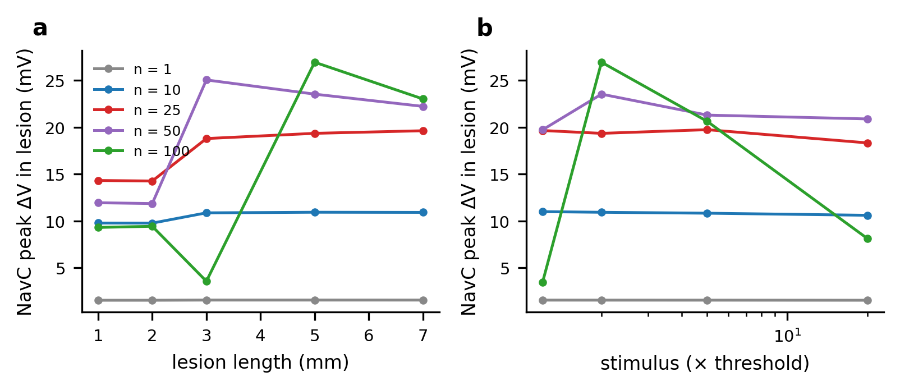

## S1 Numerical verification

| n | lagged, Δt = 2.5 µs | lagged, Δt = 0.125 µs | monolithic, Δt = 5 µs | monolithic, Δt = 0.125 µs |
|:---|---:|---:|---:|---:|
| 1 | 1.39 | 1.51 | 1.54 | 1.51 |
| 10 | 5.01 | 10.00 | 10.03 | 9.94 |
| 25 | 6.10 | 15.41 | 15.39 | 15.47 |
| 50 | 6.28 | 20.88 | 21.22 | 21.72 |

**Table S1.** The lagged coupling scheme of the earlier version vs the monolithic scheme, in the earlier full-length geometry and parameters (HH E~Na~ = +35.64 mV, 100-nA stimulus inside the compartment, Δz = 10 µm). Entries are the peak C-fiber depolarization between z = 3 and 8 mm (mV). The lagged error grows with *n*; the monolithic values are Δt-independent to within 2.4 %.

| model | n | Δz 20 µm | Δz 10 µm | production (5 µm, 1 µs) | Δz 1.25 µm | Δt 0.125 µs | conductance-implicit |
|:---|---:|---:|---:|---:|---:|---:|---:|
| HH | 1 | 1.43 | 1.53 | 1.56 | 1.57 | 1.55 | 1.54 |
| HH | 10 | 10.25 | 10.79 | 10.93 | 10.97 | 10.93 | 10.89 |
| HH | 25 | 18.88 | 19.12 | 19.34 | 19.40 | 19.39 | 19.41 |
| HH | 50 | 22.35 | 23.26 | 23.51 | 23.59 | 23.62 | 23.76 |
| NavC | 1 | 1.43 | 1.53 | 1.56 | 1.57 | 1.55 | 1.54 |
| NavC | 10 | 10.25 | 10.79 | 10.93 | 10.97 | 10.93 | 10.89 |
| NavC | 25 | 18.90 | 19.13 | 19.35 | 19.41 | 19.40 | 19.42 |
| NavC | 50 | 22.36 | 23.28 | 23.53 | 23.61 | 23.63 | 23.78 |

**Table S2.** Grid and time-step refinement of the peak C-fiber depolarization in the lesion (mV) in the production configuration. Unless stated, Δz = 5 µm, Δt = 1 µs, explicit ionic currents. "Conductance-implicit": ionic conductances in the system matrix.

## S2 Membrane verification

![**Fig. S3** Verification of the Aβ source. (a) CRRSS steady-state activation and inactivation and (b) their time constants over the modelled range, at 37 °C. (c) Action potential at a node (z = 5 mm) followed through repolarization to rest. (d) Paired-pulse recovery: peak of the response at z = 8 mm after a second stimulus, against the interpulse interval. Grey crosses mark intervals at which no second action potential propagates; the value plotted there is the decaying tail of the first action potential, not a second spike.](../results/figures/figS3_membrane_verification.png){width=100%}

| interval (ms) | APs at z = 8 mm | 2nd AP peak (mV) | 2nd AP CV (m/s) | 2nd AP conducts |
|:---|---:|---:|---:|---:|
| 0.30 | 1 | +3.4 | – | False |
| 0.50 | 1 | -58.9 | – | False |
| 0.75 | 2 | -1.3 | 36.0 | True |
| 1.00 | 2 | +2.6 | 39.2 | True |
| 1.50 | 2 | +3.9 | 40.4 | True |
| 2.00 | 2 | +4.0 | 40.4 | True |
| 3.00 | 2 | +4.0 | 40.0 | True |
| 5.00 | 2 | +4.0 | 40.0 | True |

**Table S7.** Paired-pulse recovery of the isolated Aβ fiber (2 × threshold, 0.2-ms pulses at node 0; counts and peaks read at z = 8 mm). The first action potential conducts at 40.0 m/s in every run.

| C-fiber membrane | rest (mV) | τ~m~ at rest (ms) | λ, small signal (µm) | R~in~ predicted (MΩ) | R~in~ measured (MΩ) | rheobase, 1 ms (nA) |
|:---|---:|---:|---:|---:|---:|---:|
| HH | -65.00 | 1.48 | 198 | 68.9 | 68.8 | 0.16 |
| NavC | -66.82 | 1.37 | 176 | 61.5 | 61.3 | 0.70 |

**Table S8.** Passive properties of the isolated C-fiber membranes under the production geometry. λ and *R*~in~ are small-signal values, computed from the slope conductance d*I*~ion~/d*V* at rest; *R*~in~ measured is the steady response to a 1-pA injection at z = 5 mm. Rheobase is for a 1-ms point injection at the same site.

## S3 Strength–duration characterization

| C-fiber membrane | Q_th 0.1 ms (pC) | V_peak 0.1 ms (mV) | V_peak 1 ms (mV) | V_peak 20 ms (mV) | I_th 0.1 / I_th 20 ms |
|:---|---:|---:|---:|---:|---:|
| HH, 6.3 °C | 0.14 | -30 | -51 | -53 | 21.3 |
| HH, 25 °C | 0.10 | -38 | -43 | -38 | 5.4 |
| HH, conductances × 5 | 0.11 | -38 | -54 | -56 | 12.7 |
| HH, rates & conductances × 5 | 0.07 | -48 | -52 | -53 | 4.6 |
| HH, rates & conductances × 10 | 0.05 | -51 | -53 | -53 | 2.5 |
| NavC, τ~m8~ = 1.5 ms | 0.41 | 39 | -19 | -31 | 7.3 |
| NavC, τ~m8~ = 0.05 ms | 0.16 | -24 | -34 | -39 | 4.0 |
| NavC, time constants ÷ 10, conductances × 10 | 0.22 | -19 | -31 | -31 | 1.2 |

**Table S3.** Point current injection at z = 5 mm into the isolated C-fiber. Q~th~: threshold charge for a 0.1-ms pulse; V~peak~: largest membrane potential at the injection site for a pulse 0.5 % below threshold; last column: ratio of threshold currents for 0.1-ms and 20-ms pulses.

## S4 Sensitizing bias

| model | bias (A/m²) | rest (mV) | spontaneous AP | peak V, n = 25 (mV) | peak V, n = 100 (mV) | evoked AP (any n) |
|:---|---:|---:|---:|---:|---:|---:|
| HH | 0 | -65.00 | no | -45.7 | -38.1 | no |
| HH | 0.01 | -64.20 | no | -44.9 | -37.3 | no |
| HH | 0.02 | -63.48 | no | -44.2 | -36.6 | no |
| HH | 0.03 | -62.85 | no | -43.5 | -35.9 | no |
| HH | 0.04 | -62.27 | no | -43.0 | -35.4 | no |
| HH | 0.05 | -61.73 | no | -42.4 | -34.8 | no |
| HH | 0.06 | -61.24 | no | -41.9 | -34.4 | no |
| HH | 0.07 | -60.78 | no | -41.5 | -33.9 | no |
| NavC | 0 | -66.82 | no | -47.5 | -39.9 | no |
| NavC | 0.25 | -59.30 | no | -40.0 | -32.3 | no |
| NavC | 0.5 | -56.11 | no | -36.9 | -29.1 | no |
| NavC | 1 | -52.20 | no | -33.1 | -25.2 | no |
| NavC | 1.5 | -49.52 | no | -30.5 | -22.6 | no |
| NavC | 2 | -47.39 | no | -28.4 | -20.6 | no |
| NavC | 2.5 | -45.55 | no | -26.7 | -18.8 | no |
| NavC | 3 | -43.90 | no | -25.1 | -17.3 | no |
| NavC | 3.5 | -42.35 | no | -23.7 | -15.9 | no |

**Table S4.** Uniform depolarizing bias current on the C-fiber (production configuration). "Spontaneous AP": no-stimulus control of 200 ms. Peak V: largest C-fiber membrane potential in the lesion after the Aβ volley. The HH resting state is linearly stable up to 0.095 A m^−2^ and unstable from 0.1 A m^−2^; the NavC resting state stays stable over the whole tested range (to 4 A m^−2^) and a second stable, depolarized state appears above 2.75 A m^−2^ (space-clamped analysis with linear stability from the Jacobian, `e10_equilibria.csv`).

## S5 Temporal dispersion: convergence in the number of onset phases

| study | K | Δz (µm) | spacing W/(K−1) (µs) | peak ΔV (mV) |
|:---|---:|---:|---:|---:|
| phases K | 11 | 20 | 150 | 2.23 |
| phases K | 21 | 20 | 75 | 1.31 |
| phases K | 41 | 20 | 38 | 0.97 |
| phases K | 61 | 20 | 25 | 0.91 |
| phases K | 81 | 20 | 19 | 0.89 |
| grid Δz | 41 | 20 | 38 | 0.97 |
| grid Δz | 41 | 10 | 38 | 1.02 |
| grid Δz | 41 | 5 | 38 | 1.03 |

**Table S5.** Dispersed volley (*n* = 25, *W* = 1.5 ms, NavC). The peak depends on the number of onset phases *K* until the spacing *W*/(*K* − 1) is well below the ~0.1-ms duration of one fiber's contribution; the production runs use a spacing of at most 25 µs. Grid refinement at *K* = 41 changes the peak by 6.2 %, so the sweep is run at Δz = 20 µm. One classification does depend on that choice: the synchronous *n* = 25 volley is close to Aβ conduction block, and on Δz = 20 µm its action potentials still cross the lesion, slowly (13 m/s), where every grid from Δz = 10 µm down blocks them (Table S2). The peak depolarization differs by only 2.3 % between the two grids, and the attenuations quoted in the text are ratios taken within one grid, so neither the attenuation nor the primary endpoint is affected.

## S6 The earlier full-length geometry

| electrode current | model | Aβ stimulus (nA) | propagating C-fiber AP for n ≥ | initiation (mm) | Aβ node 0 peak, n = 25 (mV) | max |u_e|, n = 25 (mV) |
|:---|---:|---:|---:|---:|---:|---:|
| omitted | HH | 3.02 | none (n ≤ 50) | – | +17 | 71 |
| omitted | HH | 10 | 25 | 0.00 | +110 | 102 |
| omitted | HH | 30 | 10 | 0.00 | +413 | 276 |
| omitted | HH | 100 | 2 | 0.00 | +1465 | 935 |
| omitted | NavC | 3.02 | none (n ≤ 50) | – | +17 | 71 |
| omitted | NavC | 10 | none (n ≤ 50) | – | +110 | 102 |
| omitted | NavC | 30 | none (n ≤ 50) | – | +414 | 277 |
| omitted | NavC | 100 | none (n ≤ 50) | – | +1466 | 938 |
| returned | HH | 3.02 | none (n ≤ 50) | – | +4 | 34 |
| returned | HH | 10 | none (n ≤ 50) | – | +24 | 65 |
| returned | HH | 30 | none (n ≤ 50) | – | +139 | 194 |
| returned | HH | 100 | 25 | 0.07 | +556 | 676 |
| returned | NavC | 3.02 | none (n ≤ 50) | – | +4 | 34 |
| returned | NavC | 10 | none (n ≤ 50) | – | +24 | 65 |
| returned | NavC | 30 | none (n ≤ 50) | – | +139 | 194 |
| returned | NavC | 100 | 50 | 0.07 | +556 | 676 |

**Table S6.** Shared compartment along the whole cable, sealed ends, Aβ electrode at node 0 inside the compartment (κ = 10^9^ m^−2^, *A*~e~ = 16.4 µm^2^). C-fiber action potentials are launched at the electrode site only with suprathreshold electrode currents; the electrode-site membrane potentials show the non-physiological state produced by 100 nA.

{width=100%}

{width=75%}
